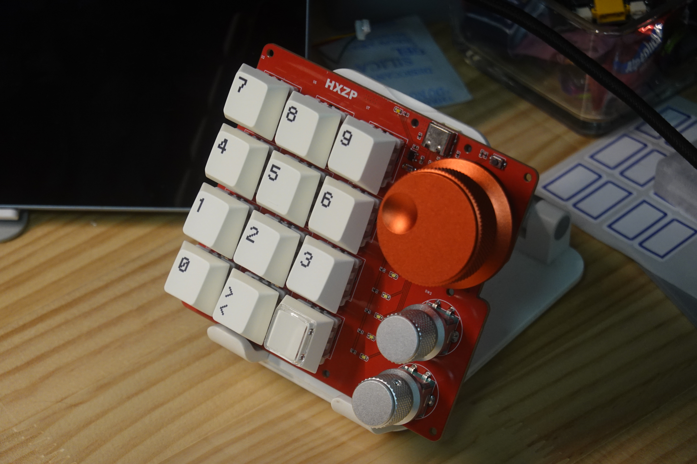
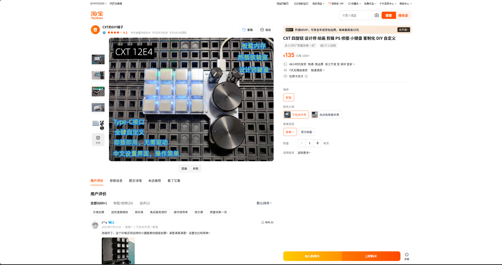

# 星火-12%配列小键盘

# 为什么做这个？

​	一开始是看上了这个键盘，但是这个价格还是很难接受，自己加旋钮和键帽可能就到了200RMB，所以想了一下还是决定自己做，还有一个理由是因为看上上图那个红色旋钮，这三个旋钮加起来要35RMB

# 是否支持vial？固件是否支持ota？

​	固件是自己手撸的，还有编码器懒得写了，让ai给我写，结果是调试了半天……还没自己写的快，不支持ota的，改按键要自己改代码，也没什么可视化的哈
